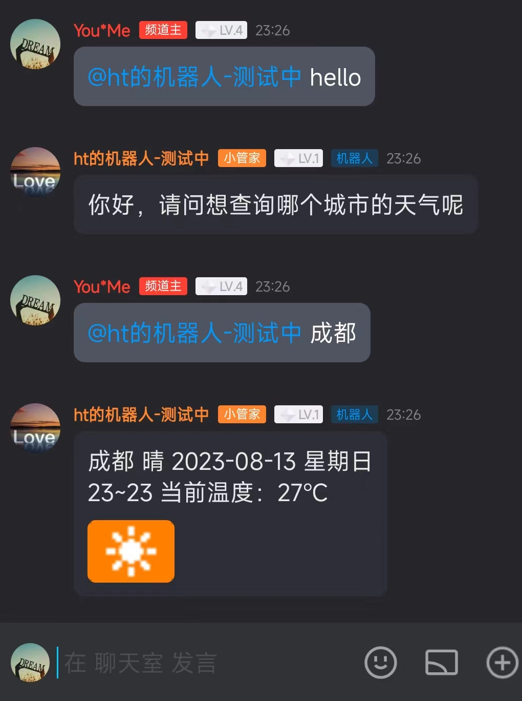

# robotQQ
尝试开发一个qq机器人

## 方案设计

1. 在手q中新建自己的频道。
2. 参考qq机器人[文档](https://bot.q.qq.com/wiki/#%E7%AE%80%E4%BB%8B)进行注册，并在自己的频道里面加入机器人。

3. 参考qq官方提供的天气机器人小实验，利用socket监听@机器人的消息，并根据消息内容进行回复。

本意是想自己研究一下[官方仓库](github.com/tencent-connect/botgo)下的代码 ，然后全部自己实现的，但是现阶段就先这样吧，以后再说。

## 使用说明

1. 频道聊天室中@该机器人并发送hello，机器人回复：“你好，请问想查询哪个城市的天气呢？”

2. 再次@机器人并回复有效的城市名，机器人将回复该城市当日的天气状况。

